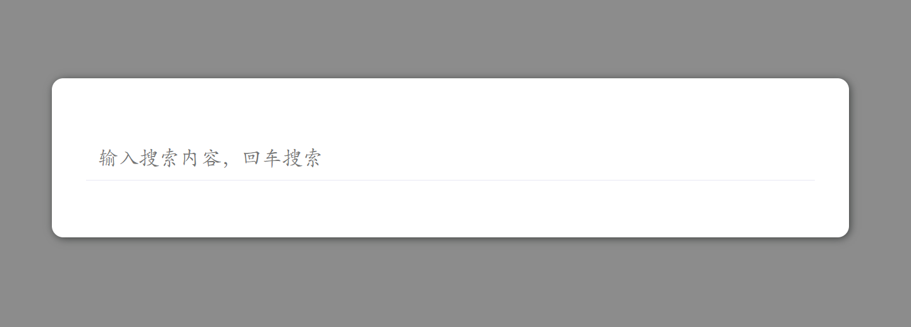
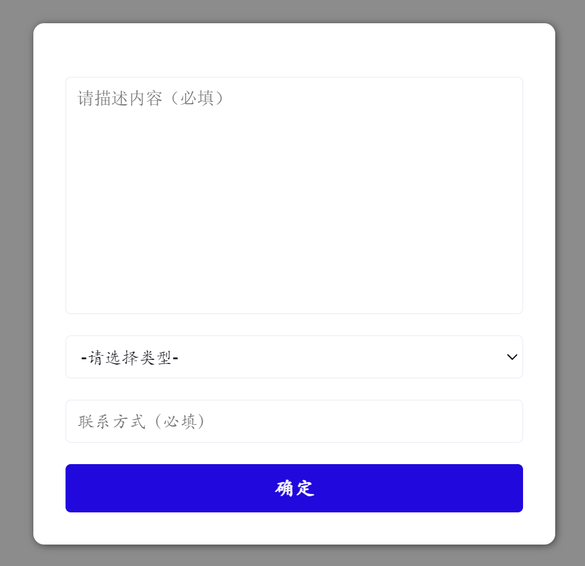

<div align="center">
    <h1 >PPSlick</h1> 
</div>

<div align="center">
    <h2>个人和初始团队网站基础弹窗组件库</h2> 
</div>

<div align="center">
    
    
    
</div>


<h4>一个javascript组件库，提供基本的联系我和搜索之类的弹窗组件（无需写html+css），拿来即用</h4>


## 使用参考

1、搜索组件，参考[testsearch.html](demo/testsearch.html)



2、联系我组件，参考[testcontact.html.html](demo/testcontact.html)



## 教程

### 引入依赖

```html
<script src="../src/ppslick.js"></script>
```

### 初始化PPEasy

```javascript
let ppSlick = new PPSlick();
```

### 创建搜索组件

#### 1.创建组件

```javascript
//创建一个搜索组件
let searcher = ppSlick.createSearcher();
```

#### 2.搜索回调函数

```javascript
//回车回调函数
searcher.onSubmit(function (text) {
    console.log(`搜索内容：${text}`);
    //将text内容发送到后端进行搜索
})
```

#### 3.搜索提示

如果需要提示，可以进行

```javascript
//输入回调函数
searcher.onInput(function (text) {
    console.log(`输入内容内容：${text}`);
    //将text内容发送到后端进行搜索提示，然后调用setSearchCandidates设置提示
    searcher.setSearchCandidates(["提示1","提示2"]);
})
```

#### 4.设置内容

```javascript
//设置placeholder
searcher.setPlaceholder("输入搜索内容，回车搜索");
//设置搜索框内的初始值
searcher.setValue("xxxxx");
```

#### 5.设置初始属性

```javascript
let options = {
    left:'20%',//组件距离左边的位置
    top:'20%',//组件距离上边的位置
    width:'300px',//组件宽度
    placeholder:'输入搜索内容，回车搜索',
    maskColor:'rgba(0, 0, 0, 0.5)',//遮罩层颜色
    backgroundColor:'white',//组件背景颜色
    fontSize:'18px',//搜索框字体大小
    fontColor:'#090910'//搜索框字体颜色
}
let searcher = ppSlick.createSearcher(options);
```


### 创建联系我组件

#### 1.创建组件

```javascript
//创建一个联系我组件
let contactMe = ppSlick.createContactMe();
```

#### 2.提交回调函数

```javascript
//提交回调函数
contactMe.onSubmit(function (des,type,phone) {
    console.log(`描述内容：${des}`);
    console.log(`业务类型：${type}`);
    console.log(`联系方式：${phone}`);
    //将内容发送到后端进行存储
})
```

#### 3.设置业务类型

```javascript
contactMe.setTypeList(["-请选择类型-",'业务问题','其他问题']);
```

#### 4.设置其他属性

```javascript
//联系我有三个小组件，分别为描述内容、业务类型、联系方式和提交按钮
//设置第0个组件的placeholer为请描述内容
contactMe.setAttribute(0,'placeholer','请描述内容')
//设置第2个组件的placeholer为联系方式
contactMe.setAttribute(2,'placeholer','联系方式')
//设置第2个组件的value为1599999999
contactMe.setAttribute(2,'value','1599999999')
//设置第3个组件的innerHTML为提交
contactMe.setAttribute(3,'html','提交')
```

#### 5.屏蔽小组件

```javascript
//如果不需要业务类型
contactMe.disableType();
//如果不需要联系方式
contactMe.disableNumber();
```

#### 6.设置初始属性

```javascript
let options = {
    left:'20%',//组件距离左边的位置
    top:'20%',//组件距离上边的位置
    width:'300px',//组件宽度
    maskColor:'rgba(0, 0, 0, 0.5)',//遮罩层颜色
    backgroundColor:'white',//组件背景颜色
    fontSize:'18px',//搜索框字体大小
    fontColor:'#090910'//搜索框字体颜色
}
let searcher = ppSlick.createContactMe(options);
```
