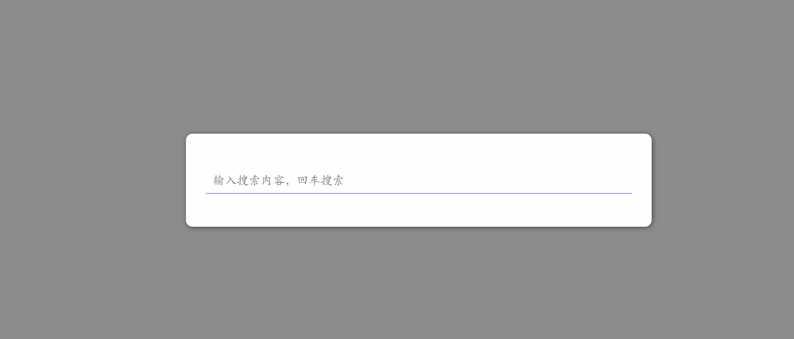
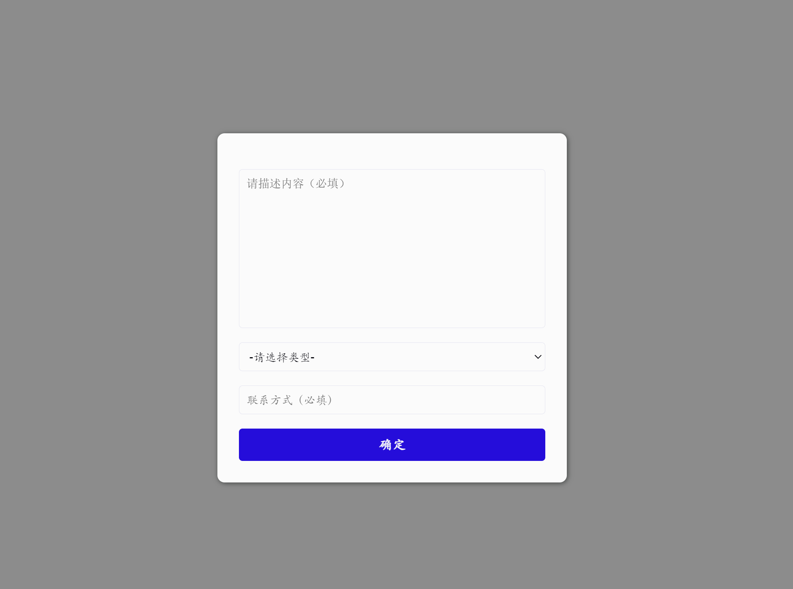
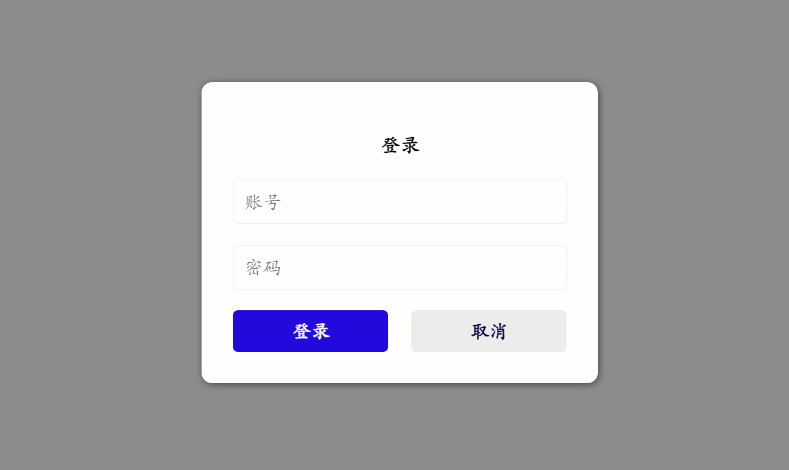
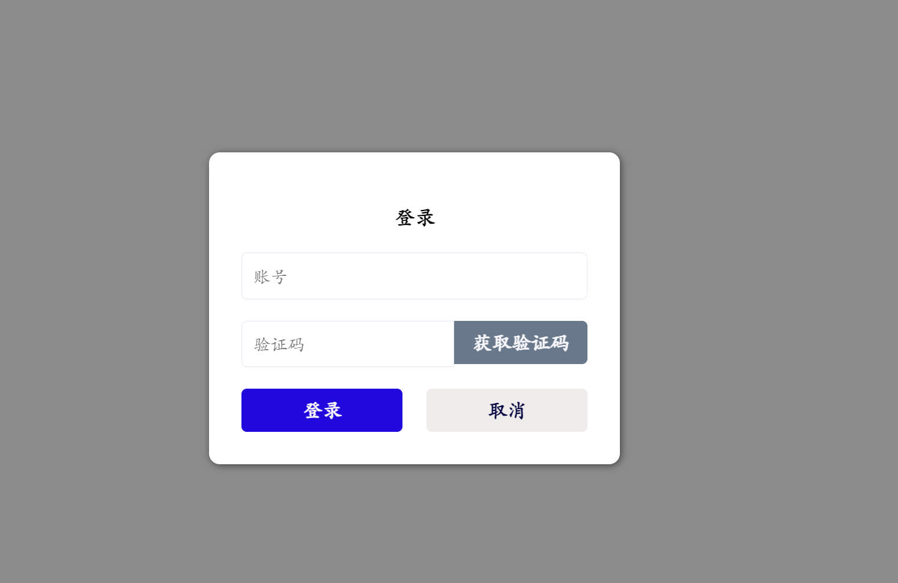
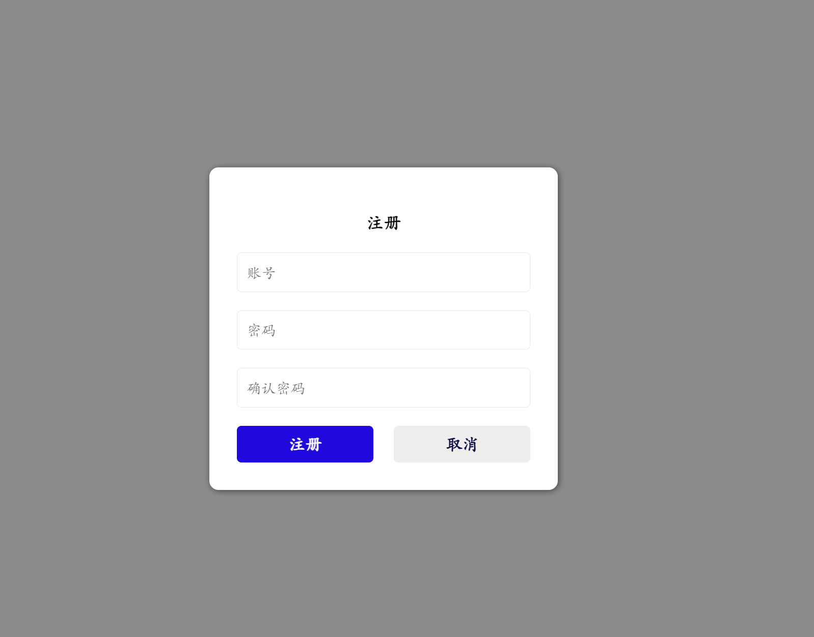
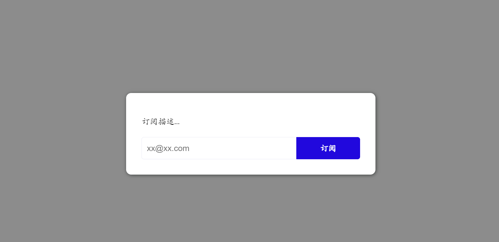

<div align="center">
    <h1 >PPSlick</h1> 
</div>

<div align="center">
    <h2>个人/初始团队的网站基础弹窗组件库</h2> 
</div>

<div align="center">
    
    
    
    
</div>


<h4>一个javascript组件库，提供基本的联系我、登录、注册、搜索和邮件订阅之类的弹窗组件（无需写html+css），拿来即用</h4>

<h4>A lightweight javascript library to create some modal windows without html and css like `contact me`、`search`、`login`、`sign up` and `email subscribe` etc.</h4>


## 使用参考

1、搜索组件，参考[testsearch.html](demo/testsearch.html)



2、联系我组件，参考[testcontact.html](demo/testcontact.html)



3、登录组件，参考[testlogin.html](demo/testlogin.html)





4、注册组件，参考[testsignup.html](demo/testsignup.html)



5、邮件订阅组件，参考[testemailsubscribe.html](demo/testemailsubscribe.html)



## 教程

### 一、引入依赖

```html
<script src="../src/ppslick.js"></script>
```


### 二、创建组件

#### 1.创建搜索组件

##### 1.1.创建组件

```javascript
//创建一个搜索组件
let searcher = PPSlick.createSearcher();
```

##### 1.2.搜索回调函数

```javascript
//回车回调函数
searcher.onSubmit(function (text) {
    console.log(`搜索内容：${text}`);
    //将text内容发送到后端进行搜索
})
```

##### 1.3.搜索提示

如果需要提示，可以进行

```javascript
//输入回调函数
searcher.onInput(function (text) {
    console.log(`输入内容内容：${text}`);
    //将text内容发送到后端进行搜索提示，然后调用setSearchCandidates设置提示
    searcher.setSearchCandidates(["提示1","提示2"]);
})
```

##### 1.4.设置内容

```javascript
//设置placeholder
searcher.setPlaceholder("输入搜索内容，回车搜索");
//设置搜索框内的初始值
searcher.setValue("xxxxx");
```

##### 1.5.设置初始属性

```javascript
let options = {
    left:'20%',//组件距离左边的位置
    top:'20%',//组件距离上边的位置
    width:'300px',//组件宽度
    placeholder:'输入搜索内容，回车搜索',
    maskColor:'rgba(0, 0, 0, 0.5)',//遮罩层颜色
    backgroundColor:'white',//组件背景颜色
    fontSize:'18px',//搜索框字体大小
    fontColor:'#090910',//搜索框字体颜色
    closeOnSubmit:'true'//提交后自动关闭该窗口
}
let searcher = PPSlick.createSearcher(options);
//closeOnSubmit:'false'时需要手动关闭组件 
//searcher.close();
```


#### 2.创建联系我组件

##### 2.1.创建组件

```javascript
//创建一个联系我组件
let contactMe = PPSlick.createContactMe();
```

##### 2.2.提交回调函数

```javascript
//提交回调函数
contactMe.onSubmit(function (des,type,phone) {
    console.log(`描述内容：${des}`);
    console.log(`业务类型：${type}`);
    console.log(`联系方式：${phone}`);
    //将内容发送到后端进行存储
})
```

##### 2.3.设置业务类型

```javascript
contactMe.setTypeList(["-请选择类型-",'业务问题','其他问题']);
```

##### 2.4.设置其他属性

```javascript
//联系我有三个小组件，分别为描述内容、业务类型、联系方式和提交按钮
//设置第0个组件的placeholer为请描述内容
contactMe.setAttribute(0,'placeholer','请描述内容')
//设置第2个组件的placeholer为联系方式
contactMe.setAttribute(2,'placeholer','联系方式')
//设置第2个组件的value为1599999999
contactMe.setAttribute(2,'value','1599999999')
//设置第3个组件的innerHTML为提交
contactMe.setAttribute(3,'html','提交')
```

##### 2.5.屏蔽小组件

```javascript
//如果不需要业务类型
contactMe.disableType();
//如果不需要联系方式
contactMe.disableNumber();
```

##### 2.6.设置初始属性

```javascript
let options = {
    left:'20%',//组件距离左边的位置
    top:'20%',//组件距离上边的位置
    width:'300px',//组件宽度
    maskColor:'rgba(0, 0, 0, 0.5)',//遮罩层颜色
    backgroundColor:'white',//组件背景颜色
    fontSize:'18px',//搜索框字体大小
    fontColor:'#090910',//搜索框字体颜色
    closeOnSubmit:'true'//提交后自动关闭该窗口
}
let contactMe = PPSlick.createContactMe(options);
//closeOnSubmit:'false'时需要手动关闭组件 
//contactMe.close();
```


#### 3.创建登录组件

##### 3.1.创建组件

```javascript
let login = PPSlick.createNormalLogin();
```

##### 3.2.提交回调函数

```javascript
//提交回调函数
login.onSubmit(function (userName,password,isRememberme) {
    console.log(`账号：${userName}`);
    console.log(`密码：${password}`);
    console.log(`是否记住我：${isRememberme}`);
})
```

##### 3.3.设置其他属性

```javascript
//设置标题
login.setTitle('登录')
//或者
// login.setAttribute(0,'html','登录')

//设置账号提示
login.setUserNamePlaceholder('请输入账号')
//或者
// login.setAttribute(1,'placeholder','请输入账号')

//更改记住我的提示
login.setRememberMeLabel('请记住我')
//更忘记密码的提示
login.setForgetPasswordLabel('忘记了密码')
```

##### 3.4.忘记密码回调函数

```javascript
login.onForgetPassword(function (user) {
    console.log(`忘记密码：${user}`);
})
```

##### 3.4.屏蔽小组件

```javascript
//禁用忘记密码
login.disableForgetPassword();
//禁用记住我
login.disableRememberMe();
```

##### 3.5.设置初始属性

```javascript
let options = {
    left:'20%',//组件距离左边的位置
    top:'20%',//组件距离上边的位置
    width:'300px',//组件宽度
    maskColor:'rgba(0, 0, 0, 0.5)',//遮罩层颜色
    backgroundColor:'white',//组件背景颜色
    fontSize:'18px',//搜索框字体大小
    fontColor:'#090910',//搜索框字体颜色
    closeOnSubmit:'true'//提交后自动关闭该窗口
}
let login = PPSlick.createNormalLogin(options);
//closeOnSubmit:'false'时需要手动关闭组件 
//login.close();
```

#### 4.创建验证码登录组件

##### 4.1.创建组件

```javascript
let login = ppSlick.createVerificationCodeLogin();
```

##### 4.2.获取验证码

```javascript
//点击获取验证码按钮时触发
login.onGetVerificationCode(function (userName) {
    console.log(`账号：${userName}`);
})
```

##### 4.3.提交回调函数

```javascript
//提交回调函数
login.onSubmit(function (userName,code) {
    console.log(`账号：${userName}`);
    console.log(`验证码：${code}`);
})
```

##### 4.4.设置其他属性

```javascript
//设置标题
login.setTitle('登录')
//或者
// login.setAttribute(0,'html','登录')

//设置账号提示
login.setUserNamePlaceholder('请输入账号')
//或者
// login.setAttribute(1,'placeholder','请输入账号')

//填写验证码
login.setVerification('请记住我')
//更改获取验证码按钮的内容
login.setVerificationButtonLabel('获取验证码')
//验证码框的提示
login.setVerificationPlaceholder('验证码')
```

##### 4.5.设置初始属性

```javascript
let options = {
    left:'20%',//组件距离左边的位置
    top:'20%',//组件距离上边的位置
    width:'300px',//组件宽度
    maskColor:'rgba(0, 0, 0, 0.5)',//遮罩层颜色
    backgroundColor:'white',//组件背景颜色
    fontSize:'18px',//搜索框字体大小
    fontColor:'#090910',//搜索框字体颜色
    closeOnSubmit:'true'//提交后自动关闭该窗口
}
let login = PPSlick.createVerificationCodeLogin(options);
//closeOnSubmit:'false'时需要手动关闭组件 
//login.close();
```


#### 5.创建注册组件

##### 5.1.创建组件

```javascript
//创建注册组件
let signup = ppSlick.createNormalSignup();
```

##### 5.2.提交回调函数

```javascript
//提交回调函数
signup.onSubmit(function (userName,password) {
    console.log(`账号：${userName}`);
    console.log(`密码：${password}`);
})
```

#### 6.邮件订阅组件

##### 6.1.创建组件

```javascript
//创建注册组件
let emailSubscription = ppSlick.createEmailSubscription();
emailSubscription.setDescription("订阅描述...");
```

##### 6.2.提交回调函数

```javascript
//提交回调函数
emailSubscription.onSubmit(function (email) {
    console.log(`邮箱：${email}`);
})
```

